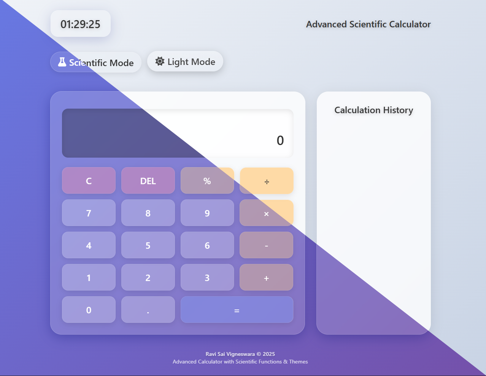

# 🔢 Modern Calculator App Website

A sleek, responsive, and animated calculator web app built with HTML, CSS, JavaScript, and Three.js. It features a glassmorphism-style UI, interactive micro-animations, a real-time clock, and a 3D animated background.

 <!-- Optional: Replace or remove this line -->

---

## 🚀 Features

- 🧮 Fully functional calculator (basic arithmetic)
- ⏰ Real-time digital clock on the top-left
- 🌐 Responsive design (mobile and desktop)
- ✨ Glassmorphism UI with modern styling
- 🎥 Animated 3D background using Three.js
- ⚡ Smooth transitions and micro-interactions

---

## 🛠️ Tech Stack

- **HTML5**
- **CSS3**
- **JavaScript (ES6)**
- **Three.js** (for 3D animations)
- **Responsive Web Design**

---

## 📱 Responsive View

The layout is optimized for:

- ✅ Windows Desktop
- ✅ macOS
- ✅ iPhones (iOS Safari)
- ✅ Android phones

---

## 🔧 How to Run Locally

1. **Clone this repository** or **download the zip**.

```bash
git clone https://github.com/yourusername/calculator-app.git
cd calculator-app
